# Auth Form with 2FA

A modern, responsive authentication flow with email/password login and Two-Factor Authentication (2FA) code verification. Built with React, TypeScript, and React Query.

 <!-- Замени на скриншот позже -->

## ✨ Features

- **Email/password login** with validation
- **Two-Factor Authentication (2FA)** with 6-digit code input
- **Auto-focus & auto-advance** between code fields
- **Paste full code** support (e.g., from SMS)
- **Countdown timer** with resend option
- **Network error simulation** (for demo purposes)
- **Test coverage**: unit and integration tests,
- **CI/CD pipeline** with GitHub Actions

## 🛠 Tech Stack

- **Core**: React 19, TypeScript, Vite
- **State Management**: React Query (TanStack)
- **Styling**: styled-components
- **Testing**: Vitest
- **Linting & Formatting**: ESLint, Prettier
- **CI/CD**: GitHub Actions
- **Deployment**: GH Pages

## 🚀 Getting Started

### Prerequisites

- Node.js v20+
- npm v10+

### Installation

1. Clone the repository:
   ```bash
   git clone github.com/Indigoinspn/auth-form.git
   cd auth-form
   ```
2. Install dependencies:

   ```bash
   npm install
   ```

3. Start the development server:

   ```bash
   npm run dev
   ```

4. Open http://localhost:5173 in your browser.
   Available Scripts:
   npm run dev - Starts dev server
   npm run build - Builds for production
   npm run preview - Locally previews production build
   npm run lint - Checks code style
   npm run lint:fix - Fixes code style issues
   npm run test - Runs all tests
   npm run test:watch - Runs tests in watch mode

### 🧪 Testing

The project includes comprehensive tests:

Unit tests for utility functions (validateEmail, validatePassword)
Integration tests for custom hooks (useAuth, useTwoFactorManager, useCountdown)

```bash
 npm run test
```

### 🤖 CI/CD

Every push to master and pull request triggers:

- Code linting (ESLint)
- Code formatting check (Prettier)
- Full test suite (Vitest)

### 📝 Credentials for Demo

The app includes built-in mock logic to simulate various authentication scenarios.
Use the credentials below to test all flows.

**Settings**:

- Duration: **30 seconds** (`TIMER_DURATION = 30`)
- Code length: **6 digits** (`TWO_FACTOR_CODE_LENGTH = 6`)
- Password length **8 digits** (`PASSWORD_LENGTH = 8`)

## ✅ Form Validation

The login form includes real-time validation with clear error messages to guide the user.

### 📧 Email Field

| Scenario           | Behavior                     |
| ------------------ | ---------------------------- |
| **Empty**          | Shows "Email is required"    |
| **Invalid format** | Shows "Invalid email format" |

> ⚠️ The email validator uses a simplified regex (`^[^\s@]+@[^\s@]+\.[^\s@]+$`) to catch common mistakes while allowing most real-world emails.

---

### 🔐 Password Field

| Scenario                               | Behavior                                       |
| -------------------------------------- | ---------------------------------------------- |
| **Empty**                              | Shows "Password is required"                   |
| **Too short** (less than 8 characters) | Shows "Password must be at least 8 characters" |

> ✅ Password length is configurable via `PASSWORD_LENGTH = 8` in `src/lib/constants.ts`.

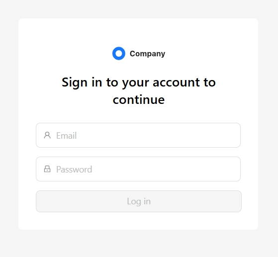
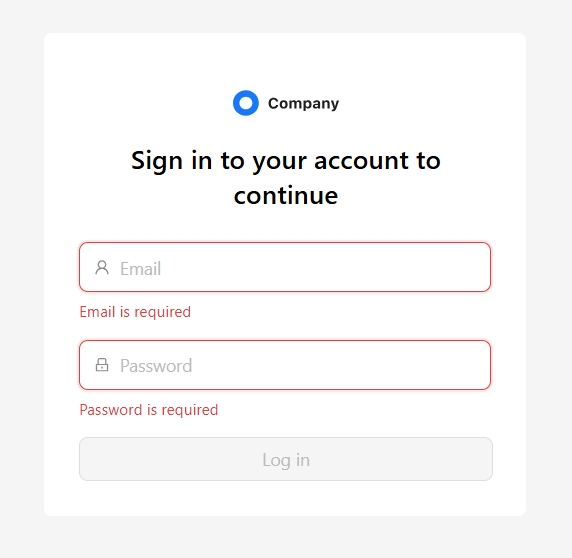

---

### 🔢 2FA Code Input

- **Auto-focus**: First field receives focus on load.
- **Auto-advance**: After entering a digit, focus moves to next field.
- **Backspace**: Deletes current digit and moves focus to previous field.
- **Delete**: Deletes current digit and moves focus to nex field.
- **Paste**: Full 6-digit code can be pasted into first field → auto-fills all fields.
- **Smart error handling**:
- If an **invalid code** is submitted → error message appears, **Continue button is disabled**.
- If user **starts editing** (deletes any digit) → error is **cleared automatically**,
  **Continue button becomes enabled** (when form is filled).
- **Exceptions**:
  - `Code expired` → "Get new" button appears.
  - `Network error` → Continue stays disabled until page is refreshed.

> ⭐ All validation logic is implemented without external libraries — pure React + TypeScript.

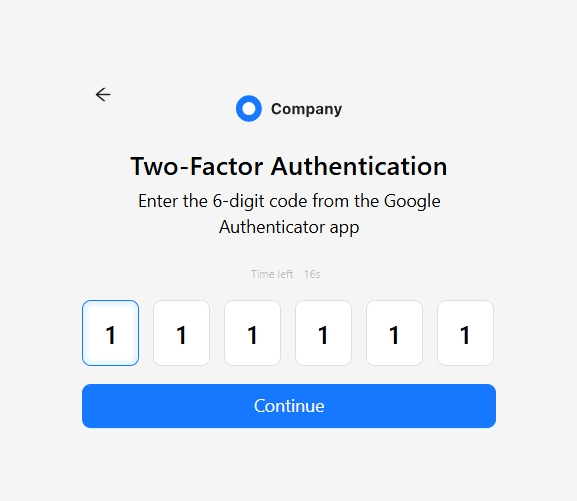
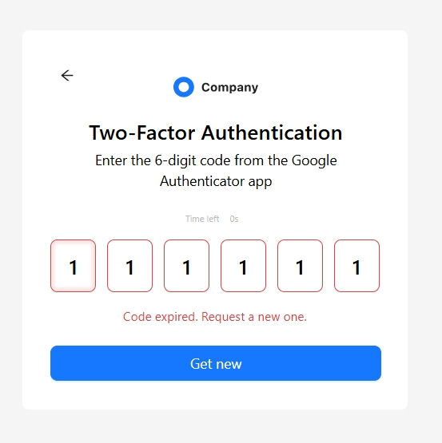

---

### 🔑 Valid Credentials

| Field        | Value                 |
| ------------ | --------------------- |
| **Email**    | `valid_email@mail.ru` |
| **Password** | `55555555`            |
| **2FA Code** | `123456`              |

✅ **Result**: Successful login → 2FA → Success page.

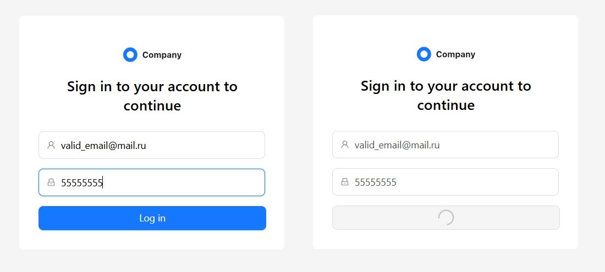
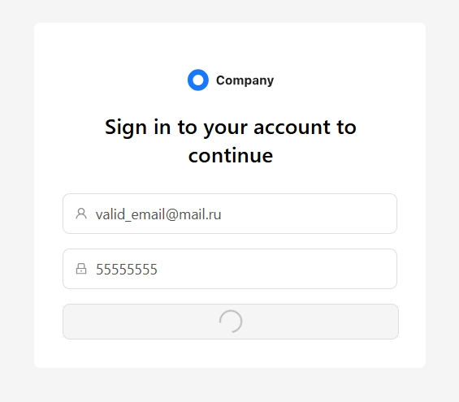
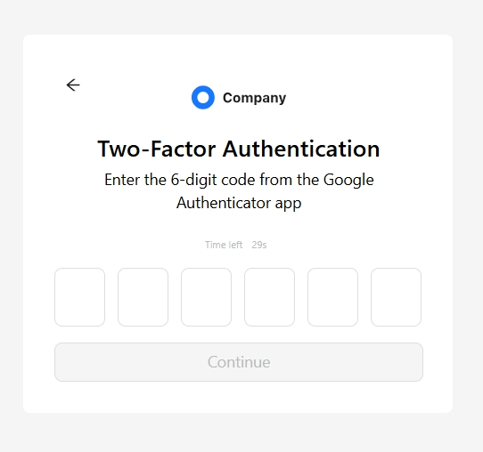
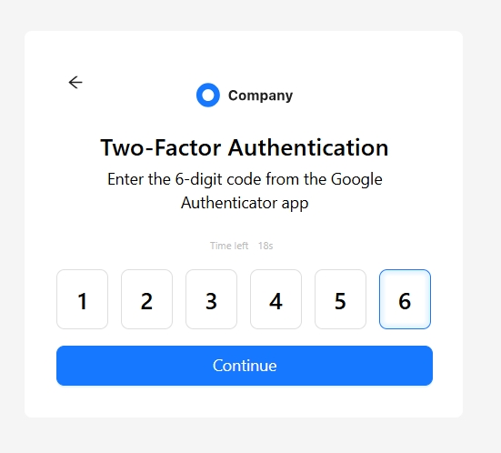
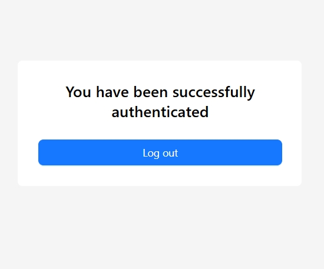

---

### ⏳ Code Expired (2FA only)

1. Enter valid credentials to reach 2FA.
2. **Wait 30 seconds** (timer expires).
3. Try to submit any code.

❌ **Result**: "Code has expired" error → **Get new** button appears → On click resets timer.

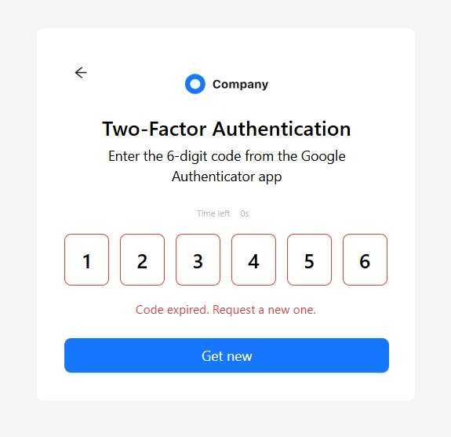

---

### 🌐 Network Error (Connection Lost)

| Component      | Trigger                                           |
| -------------- | ------------------------------------------------- |
| **Login Form** | Email: `connection_lost@yahoo.com` (any password) |
| **2FA Form**   | Code: `888888`                                    |

❌ **Result**: "Network error" message.

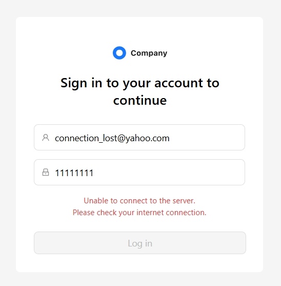
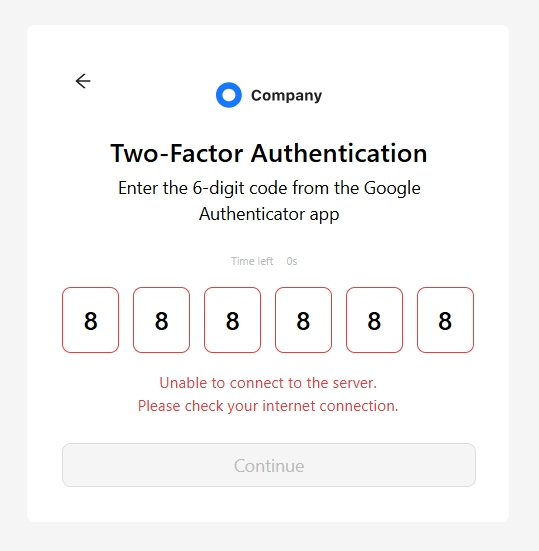

---

### 🚫 Rate Limited (Login only)

| Field        | Value                    |
| ------------ | ------------------------ |
| **Email**    | `attempts_limited@ya.ru` |
| **Password** | any                      |

❌ **Result**: "Too many attempts. Please try again later."

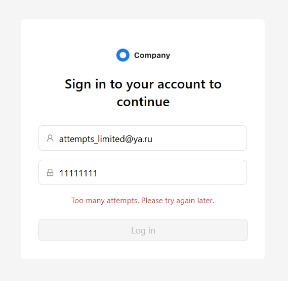

---

### ❌ Invalid Credentials / Code

| Scenario             | Input                                    | Exceptions                                                |
| -------------------- | ---------------------------------------- | --------------------------------------------------------- |
| **Invalid Login**    | Any email/password **except** valid ones | email `connection_lost@yahoo.com` - connection lost error |
|                      |                                          | email `attempts_limited@ya.ru` - attempts limited error   |
| **Invalid 2FA Code** | Any 6-digit code **except** `123456`     | code '888888' -- connection lost error                    |

❌ **Result**:

- Login: "Invalid credentials"
- 2FA: "Invalid code"
- 
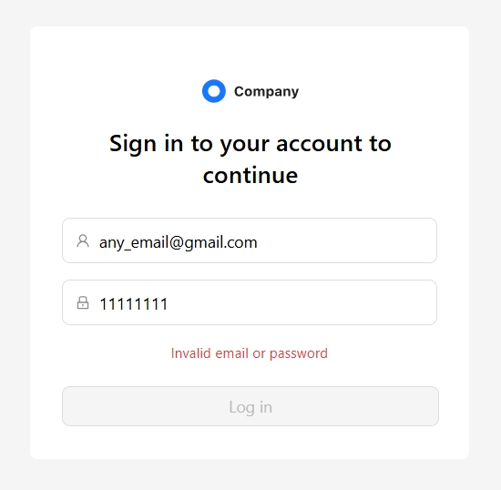
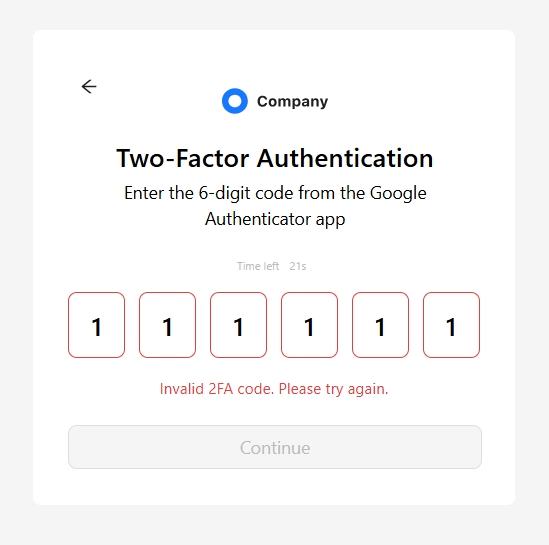

---
